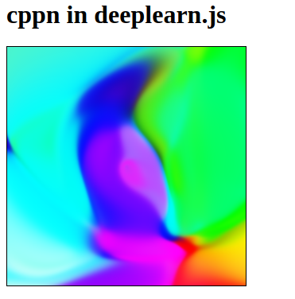

Using [deeplearning.js](https://github.com/PAIR-code/deeplearnjs), this is a re-implementation of
[Generating Abstract Patterns with TensorFlow](http://blog.otoro.net/2016/03/25/generating-abstract-patterns-with-tensorflow/) by the amazing [hardmaru](https://github.com/hardmaru)! All credit to hardmaru; I've done nothing but (hackily) port the code.

I've done it using no other JS libs, and I haven't written JS for many years,
so the code is probably terrible; forgive me!

### Usage

Clone the repo and open the html file. You should seem something like this:

Refresh for new art!

Take a look in `cppn.js` and maybe modify `netSize` or `latentDim` and see
what it does!

### Why?

deeplearnjs already has a [cppn
implementation](https://github.com/PAIR-code/deeplearnjs/tree/master/demos/nn-art),
but it's in TypeScript and has a lot of bells and whistles. I wanted something
simple so I could understand it.
